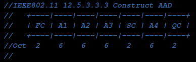
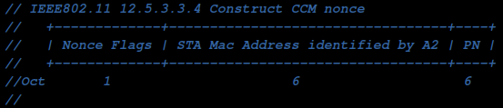
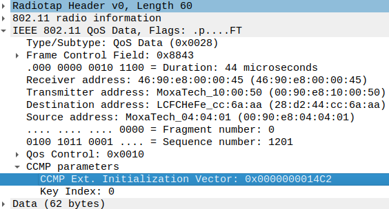
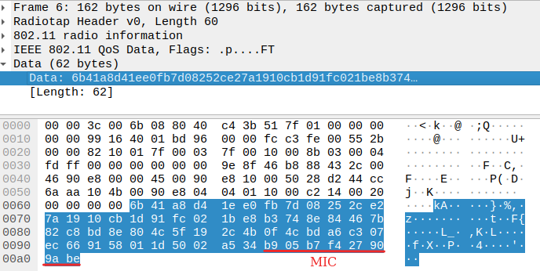
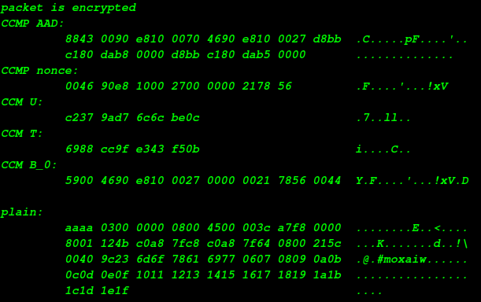
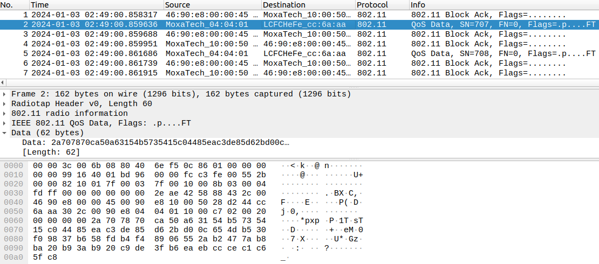
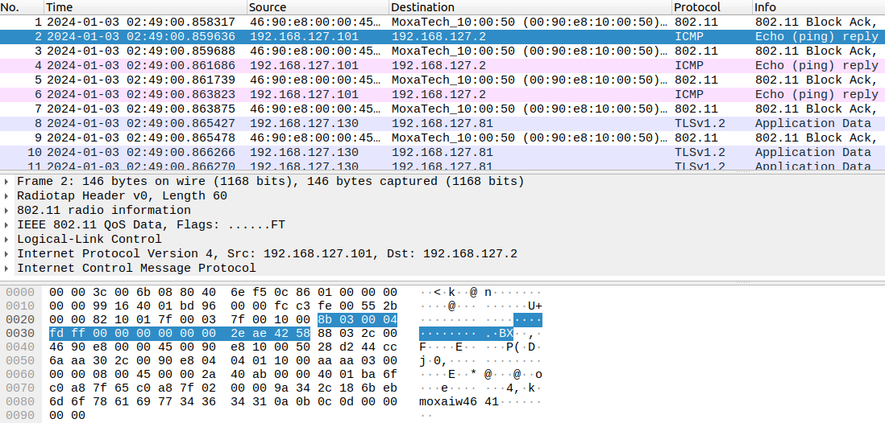

# WiFi packet decryptor
The most popular WiFi packet debug tool is Wireshark without a doubt. The wireshark supports packet capturing, cipher decrypting and payload parsing. However, for debugging of controller-based roaming in moxa, the wireshark was not suitable for the below reasons.
1. No key exchange process in controller-based roaming.<br>
    Wireshark provides a cipher decrypting feature based on the PMK provided by the user and the key exchange components in four-way. Keys was generated by WAC instead of negotiated between devices in the controller-based roaming. That's no way to get the PTK without the component of key exchange in wireshark.
2. The key was transmitted under encrypted tunnel in controller-based roaming.<br>
    Wireshark also allows user type the TK directly to decrypt the WiFi packet. This feature may just take effect in run time. It doesn't supported post-processing (It means that packets can only be decrypted after the TK giving). However, the key was delivered under encrypted tunnel in controller-based roaming, and the sniffer is hard to get the TK from cipher.

Based on the above reasons, we implement a CCMP decryptor support interval decrypting based on keys corresponding to specific times.<br>
The step of CCMP decrypting can seperate to three parts.
1. [Get the cipher from stored WiFi packet](#get_the_cipher_from_stored_wifi_packet)
2. [Cipher decrypting](#cipher_decrypting)
3. [Replace the cipher with plain text](#replace_the_cipher_with_plain_text)

<h2 id=get_the_cipher_from_stored_wifi_packet> Get the cipher from stored WiFi packet. </h2>

PCAP and PCAPNG(PCAP Next Generation) is the most popular format for network packet storing. It's also the default format of `tcpdump` and `wireshark`.<br>
### PCAP parser
The PCAP format file contains a global header and a stack of packets (can sperate to packet header and packet payload).<br>


The total length of pcap global header is 24 bytes and start from a magic number `0xa1b2c3d4`, then the version, time zone, flags, snap length and network type present sequencely.<br>
The packet section can seperate to packet header and packet payload. The packet header contains the timestamp and length of captured packet. And the packet payload was constructed by `radiotap`, `IEEE802.11 header` and upper data.<br>

### PCAPNG parser

The PCAPNG is standard as `PCAP Next Generation`, extending the pacp format to store additional information of network status.<br>
A PCAPNG file is organized in blocks. The blocks build a logical hierarchy as they refer to each other. All the block share a common section header.<br>
```replace_the_cipher_with_plain_text
- Section Header
  +- Interface Description
     +- Simple Packet
     +- Enhanced Packet
     +- Interface Statistics
```
The section header start from block type `0x0a0d0d0a` (`\n\r\r\n` in ASCII code), total_length, magic number `0x1a2b3c4d`, version and so on.<br>
The interface description block records the information of captor, such as `if_name (eth0)`, `if_os (ubuntu 20.04)`, `if_hardware(Intel(R) PRO/1000 MT Network Connection)` and so on.<br>
The Simple Packet and Enhance Packet block is used to store the packet content. The Enhance Packet block has an additional timestamp compared to the Simple Packet block.


<h2 id=cipher_decrypting> Cipher decrypting</h2>
The setup flag `data protected` in Frame Control Field in IEEE802.11 header indicates the packet payload was encrypted.<br>


### CCMP decapsulation


According to the `Chapter 12.5.3 CTR with CBC-MAC protocal (CCMP)` in IEEE802.11 standard, the CCMP-128 decryptor requires `plain text`, `AAD` and `Nonce` to decrypt cipher.<br>
* AAD <br>
    AAD is standard as Additional Authentication Data. The AAD was composed of IEEE802.11 header. The format is as below.<br>
    The AAD is used to calculate MIC (Message Integrity Code). For the RSN, the MIC is 8 bytes and will be append to the cipher text. decryptor can check the integrity of plain text via comparing the MIC. 
    
* Nonce <br>
    Nonce is also known as initial vector (IV) in CCM. The cipher will be scramble by IV even with the same plain text and cipher key.<br>
    The Nonce is composed of second Address in IEEE802.11 header and packet number. The format is as the below.<br>
    <br>

The decrypt process is as the below.
1. Construct AAD and Nonce from IEEE802.11 header and CCMP header.<br>
    
2. Separate chipher text and MIC.<br>
    
3. Decrypt chipher by the TK, Nonce.
4. Calculate MIC again based on the plain text, AAD, and TK.
5. Comparing the calculate MIC and the MIC extracts from packet.  
    

<h2 id=replace_the_cipher_with_plain_text> Replace the cipher with plain text </h2>

After decrypting, the last step is replacing the cipher with plain text. In order to make wireshark parsing the network stack, a few things we should do in advence.<br>
1. The wireshark will only parses the network stack when the packet is unencrypted. The `data protected` flag should be reset ot indicate the plain text presented.
2. The CCMP header between IEEE802.11 header and data field should be removed.
3. The length field in packet header should be reduced by 16 (8 bytes for CCMP header, 8 bytes for MIC).  
Before decrypting<br>
<br>
After decrypting<br>
<br>