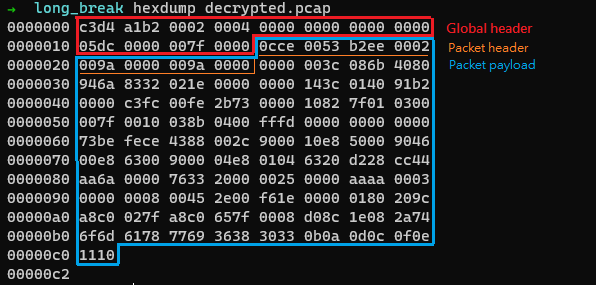
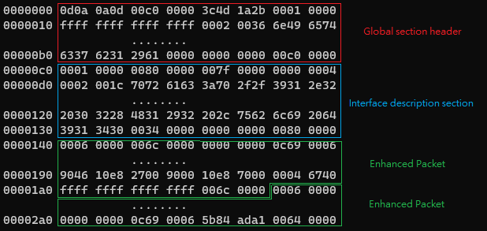
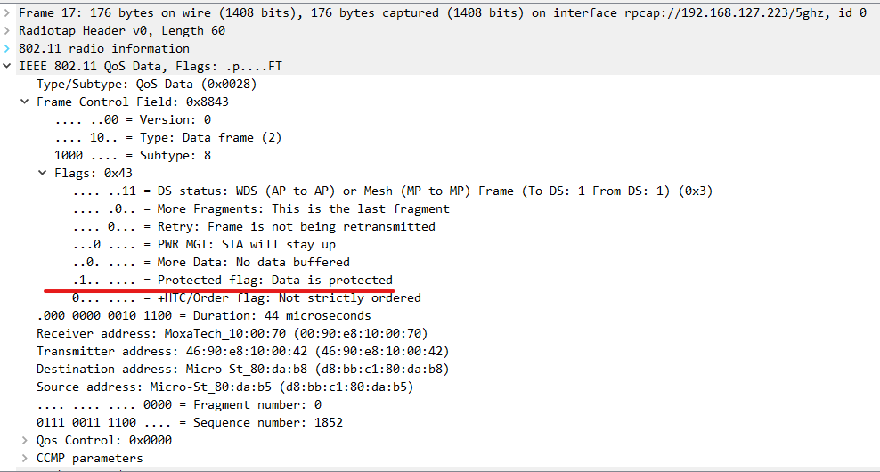
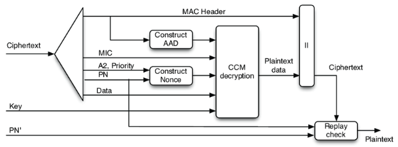

# WiFi packet decryptor
The most popular WiFi packet debug tool is Wireshark without a doubt. The wireshark supports packet capture, cipher decrypt and payload parsing. However, for debugging of controller-based roaming in moxa, the wireshark was not suitable for the below reasons.
1. No key exchange process in controller-based roaming.
    Wireshark provides a cipher decrypting feature based on the PMK provided by the user and the key exchange components in four-way. Keys was generated by WAC instead of negotiated between devices in the controller-based roaming. That's no way to get the PTK without the component of key exchange in wireshark.
2. The key was transmitted under encrypted tunnel in controller-based roaming.
    Wireshark also allows user type the TK directly to decrypt the WiFi packet. This feature may just take effect in run time. It doesn't supported post-processing (It means that packets can only be decrypted after the TK giving). However, the key was delivered under encrypted tunnel in controller-based roaming, and the sniffer is hard to get the TK from cipher.

Based on the above reasons, we implement a CCMP decryptor support interval decrypting based on keys corresponding to specific times.<br>
The step of CCMP decrypting can seperate to three parts.
1. Get the cipher from stored WiFi packet.
2. Cipher decrypting.
3. Replace the cipher with plain text.

## Get the cipher from stored WiFi packet.
PCAP and PCAPNG(PCAP Next Generation) is the most popular format for network packet storing. It's also the default format of `tcpdump` and `wireshark`.<br>
### PCAP parser
The PCAP format file contains a global header and a stack of packets (can sperate to packet header and packet payload).<br>


The total length of pcap global header is 24 bytes and start from a magic number `0xa1b2c3d4`, then the version, time zone, flags, snap length and network type present sequencely.<br>
The packet section can seperate to packet header and packet payload. The packet header contains the timestamp and length of captured packet. And the packet payload was constructed by `radiotap`, `IEEE802.11 header` and upper data.<br>

### PCAPNG parser

The PCAPNG is standard as `PCAP Next Generation`, extending the pacp format to store additional information of network status.<br>
A PCAPNG file is organized in blocks. The blocks build a logical hierarchy as they refer to each other. All the block share a common section header.<br>
```
- Section Header
  +- Interface Description
     +- Simple Packet
     +- Enhanced Packet
     +- Interface Statistics
```
The section header start from block type `0x0a0d0d0a` (`\n\r\r\n` in ASCII code), total_length, magic number `0x1a2b3c4d`, version and so on.<br>
The interface description block records the information of captor, such as `if_name (eth0)`, `if_os (ubuntu 20.04)`, `if_hardware(Intel(R) PRO/1000 MT Network Connection)` and so on.<br>
The Simple Packet and Enhance Packet block is used to store the packet content. The Enhance Packet block has an additional timestamp compared to the Simple Packet block.


## Cipher decrypting
The setup flag `data protected` in Frame Control Field in IEEE802.11 header indicates the packet payload was encrypted.<br>


### CCMP decapsulation


According to the `Chapter 12.5.3 CTR with CBC-MAC protocal (CCMP)` in IEEE802.11 standard, the CCMP-128 decry